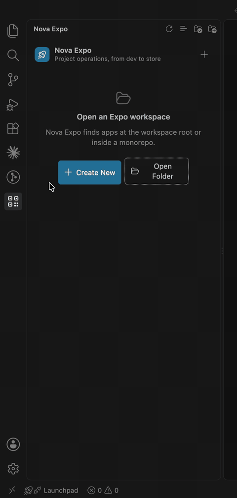
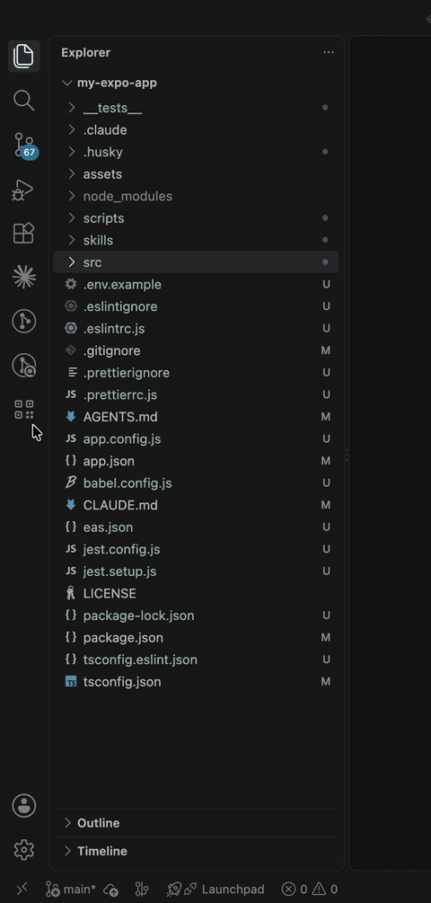

# Nova Expo

[](https://github.com/karodgers/expo-workflows/actions/workflows/ci.yml)
[](LICENSE)
[](https://code.visualstudio.com/)

Nova Expo turns the Expo and EAS release lifecycle into an organized VS Code
workflow. Use the Activity Bar dashboard to move from local development
through builds, updates, store submission, and production checks without
memorizing CLI commands.

## Contents

- [Live preview](#live-preview)
- [Features](#features)
- [Requirements](#requirements)
- [Installation](#installation)
- [Getting started](#getting-started)
- [Settings](#settings)
- [Execution model](#execution-model)
- [Security and privacy](#security-and-privacy)
- [Development](#development)
- [Contributing](#contributing)
- [License](#license)

## Live preview

| Create a project | Project dashboard |
| --- | --- |
|  |  |
| Name the folder, pick an Expo SDK, and choose optional packages. | Ship-cycle actions, build profiles, and 40+ searchable workflows. |

## Features

- Guided Nova Expo project creation with SDK, package, and validation choices
- Automatic Expo project discovery at the workspace root and in monorepos
- An always-available project switcher for workspace apps or another folder
- Guided development, build, update, submit, and release-readiness flows
- Build profiles and project configuration at a glance
- More than 40 searchable workflows grouped by purpose
- Cancellable live output for deterministic tasks
- Real integrated terminals for login, credentials, and other interactive EAS
  workflows
- Confirmation before project-changing or remote release operations
- Retained task output and stop controls for persistent development processes
- Context-aware failure recovery links in notifications and retained task
  output
- Guided next-step notices for dependency installation and EAS onboarding
- A retained Open Project action when the new-project workflow completes

## Requirements

- VS Code 1.94 or newer
- An Expo project with Node.js and its dependencies installed
- Bash on macOS or Linux. On Windows, set `novaExpo.shellPath` to a
  compatible Git Bash or WSL shell
- An Expo account for EAS cloud operations

The maintained workflow scripts are bundled with the extension. A separate
toolkit installation is not required.

## Installation

Nova Expo is not yet published to the VS Code Marketplace. Until then, install
it from a packaged build:

```sh
git clone https://github.com/karodgers/expo-workflows.git
cd expo-workflows
npm install
npm run package
npx --yes @vscode/vsce package --no-dependencies -o nova-expo.vsix
code --install-extension nova-expo.vsix
```

## Getting started

Open the **Nova Expo** icon in the Activity Bar. The extension finds every
local `package.json` that declares `expo`, excluding generated and dependency
folders. Pick a project from the switcher, or use **Create New Project** to
scaffold one, then work through the dashboard's development, build, update,
submit, and release-readiness flows.

## Settings

| Setting                | Description                                                                                    | Default |
| ----------------------- | ----------------------------------------------------------------------------------------------- | ------- |
| `novaExpo.toolkitPath`  | Optional local `workflows` directory override. Machine/remote-scoped only; a relative path is refused. | `""`    |
| `novaExpo.shellPath`    | Bash-compatible shell used to run Nova Expo workflows.                                          | `bash`  |
| `novaExpo.nodePath`     | Node.js 22.13+ executable used by the Nova Expo project initializer.                            | `node`  |

## Execution model

Dashboard tasks run deterministically without prompts. Tasks that require a
TTY always open in VS Code's integrated terminal.

Nova Expo runs no command in an untrusted or virtual workspace. In an
untrusted workspace the dashboard still reads the project configuration and
explains what trusting the workspace unlocks.

## Security and privacy

Nova Expo does not collect telemetry. Commands execute locally against the
active project; Expo and EAS commands communicate with their normal services.
See [Execution model](#execution-model) above for the workspace-trust and
confirmation policy that guards remote and project-changing operations.

If you discover a security issue, please open an issue on the
[issue tracker](https://github.com/karodgers/expo-workflows/issues) rather
than filing a public report with exploit details.

## Development

```sh
npm install
npm test
npm run watch
```

The extension host code in `src/` and the dashboard webview in
`src/webview/` are bundled separately, type-checked against different
libraries, and share only the message contract in
`src/webviewProtocol.ts`. `npm test` type-checks both before running the unit
tests.

Press **F5** to launch an Extension Development Host. To create an installable
build, run `npm run package` and then package the directory with
`@vscode/vsce`.

| Script                | Purpose                                          |
| ---------------------- | ------------------------------------------------- |
| `npm run compile`     | Copy workflow scripts and build the extension.   |
| `npm run watch`       | Rebuild on change during development.            |
| `npm run check`       | Type-check the extension host and the webview.   |
| `npm run format`      | Format the repository with Prettier.             |
| `npm test`            | Type-check, then run the unit and contract tests.|
| `npm run package`     | Produce a production build.                      |

## Contributing

Issues and pull requests are welcome. Before opening a pull request:

1. Run `npm test` and `npm run format:check` — CI enforces both.
2. Keep changes to the webview (`src/webview/`) and the extension host
   (`src/`) isolated to their message contract in `src/webviewProtocol.ts`.
3. Update [CHANGELOG.md](CHANGELOG.md) for user-facing changes.

## License

[MIT](LICENSE)
